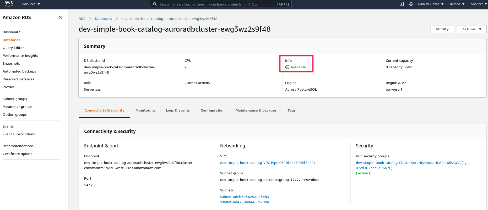
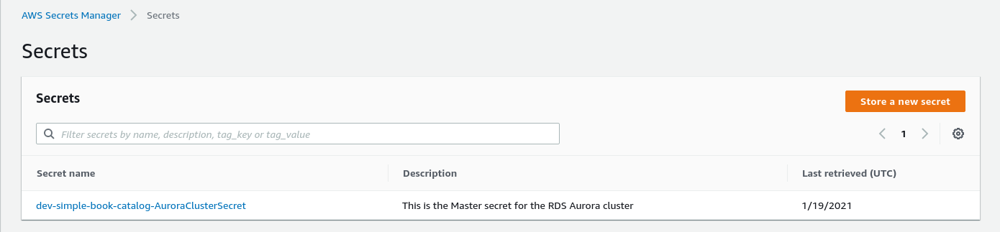
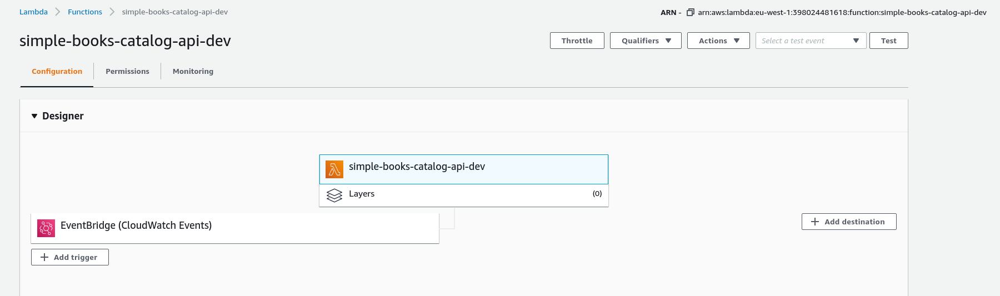
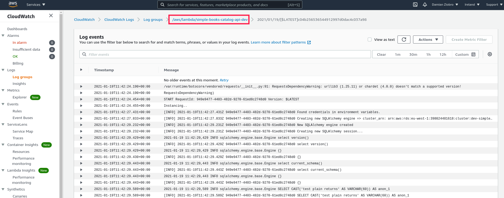

Shell app with Vue.js UI + Flask RESTful API + RDS Aurora PostgreSQL and IaaC-based deployment
==================

This is the skeleton skeleton app containing implementation and deployment of
Full Stack application with 3 tires: UI + API + Database deployed into **AWS** using Infrastructure 
as a Code (IaaC) scripts and frameworks.

Summary
--------
_The application consists of 3 tiers_ separated and in 3 directories which could
be deployed and developed separately:
* **database tier** - **PostgreSQL** database deployed to [**AWS**](https://aws.amazon.com/) as RDS Aurora
  Serverless service using [**Serverless Framework**](https://www.serverless.com/)

  Database IaaC resources and code are placed in [db](db) directory

* **RESTful API tier** - implemented using [**Flask**](https://flask.palletsprojects.com/en/1.1.x/) and deployed using [**Zappa**](https://github.com/Miserlou/Zappa) into
  **API Gateway** and **AWS Lambda**. It communicates with database using [**SQLAlchemy**](https://www.sqlalchemy.org/)
  Additionally [**OpenAPI**](https://swagger.io/specification/)-based API
  documentation is defined in [api/swagger](api/swagger) and generated by [**Swagger**](https://swagger.io/)

  RESTful API IaaC resources and code are placed in [api](api) directory

* **Vue.js User Interface** - simple user interface implemented using [**Vue.js**](https://vuejs.org/) framework **HTML**, **CSS** and **JavaScript**
  and deployed to [**AWS S3 as Static Hosting Website**](https://docs.aws.amazon.com/AmazonS3/latest/dev/WebsiteHosting.html) using Serverless 
Framework's plugin [**serverless-finch**](https://www.npmjs.com/package/serverless-finch)

  Vue.js User Interface IaaC resources and code are placed in [app_ui](app_ui) directory

Live Demo
--------

[**Website UI URL**](http://dev-simple-book-catalog-app-ui.s3-website-eu-west-1.amazonaws.com/)

[OpenAPI-based API documentation](https://xeyvfe7639.execute-api.eu-west-1.amazonaws.com/dev/apidocs/#/)
[RESTful API URL](https://xeyvfe7639.execute-api.eu-west-1.amazonaws.com/dev/apidocs/#/)


Database tier
--------
**Database**: [RDS PostgreSQL Aurora Serverless](https://aws.amazon.com/rds/aurora/serverless/). Related deployment resources are placed here:[AuroraRDSServerless.yml](db/resources/rds/AuroraRDSServerless.yml) 

**Credentials**: Credentials are deployed to [AWS Secrets Manager](https://aws.amazon.com/secrets-manager/). Related deployment resources are placed here:[AuroraRDSServerless.yml](db/resources/rds/AuroraRDSServerless.yml)

**VPC**: RDS database is deployed into AWS VPC. Related deployment resources are placed in [db/resources/vpc](db/resources/vpc)

**Deployment**: 
ALL the resources required to deploy database and make it up and running (including RDS Cluster, Security Grups, IAM roles, Secrets Manager, VPC, subnets etc.) are implemented using
**Infrastructure as a Code (IaaC)** principles in file [serverless.yml](serverless.yml) and folder [db/resources](db/resources)

Additionally there is helper AWS lambda function deployed for automatic database schema
migration (creating database and tables after deployment). It is able to detect
whether detabase and table was already created and create them if don't exist.
It is defined in [db/code/db.py](db/code/db.py) and creates tables defined in
the SQLAlchemy models in [db/code/models.py](db/code/models.py)

There is **one command deployment of database tier** without additional configuration. 
Just [set up AWS credentials](https://docs.aws.amazon.com/sdk-for-java/v1/developer-guide/setup-credentials.html) and run this command:
`make deploy-db` 


When deployed we can see that database is up and running in AWS Console in RDS
section:



Also we can see that database credentials were generated and deployed to AWS
Secrets Manager:



RESTful API tier
--------
**Code**: The RESTful API was implemented using [Flask](https://flask.palletsprojects.com/en/1.1.x/) framework and process database operations using [**SQLAlchemy**](https://www.sqlalchemy.org/) framework.
Endpoints of RESTful API are defined in [api/books_catalog_api.py](api/books_catalog_api.py) file.

**Docs**: Documentation for the RESTful API has been created using OpenAPI
specification and generated using [**flask-swagger**](https://pypi.org/project/flask-swagger/) plugin.

**Tests**: 
* **Unit tests** - unit tests are defined in [tests/test_api.py](tests/test_api.py). TODO: update coverage to 100%
* **E2E-Tests** - **TODO** - should be implemented and placed in e2e-tests directory.
* **load-tests** - [locust](https://locust.io/)-based simple scripts have been
 implemented for load testing RESTful API in [load-tests](load-tests) directory. **TODO**: update script and make it working

**Deployment**:
*  RESTful API is being deployed into serverless AWS resource: **API Gateway** and **AWS Lambda**. 
* Deployment scripts is implemented using [**Zappa**](https://github.com/Miserlou/Zappa) tool. Settings of deployment are implemented in [api/zappa_settings.json](api/zappa_settings.json) file.

**CORS**:
Please notice that in [api/books_catalog_api.py] CORS is enabled for any origin using
[**flask-cors**](https://flask-cors.readthedocs.io/en/latest/) plugin. It was
enabled here as API origin is different than UI app origin. In real-world PROD
solutions CORS should be disabled and instead the same origin/domain could be assigned
for bot API (backend) and UI app (frontend) using **AWS Route53**. See **[TODO](#TODO) section**.

There is **one command deployment of RESTful API tier** without additional configuration. 
Just [set up AWS credentials](https://docs.aws.amazon.com/sdk-for-java/v1/developer-guide/setup-credentials.html) and run this command:
`make deploy-api` 

When deployed we can see API Gateway in AWS Console:


Also we can see API related AWS Lambda function in AWS Console:

As you can see lambda has **CloudWatch-Events-based trigger** assigned. **It triggers
lambda every 4 mins to keep it warm**


Vue.js User Interface tier
--------
**Code**: Simple UI application was implemented using [vue.js](https://vuejs.org/) framework 
and it consumes API using [axios](https://www.npmjs.com/package/axios) library. 
Code is placed in [api_ui](api_ui) directory with:
* HTML template: [app_ui/index.html](app_ui/index.html)
* CSS styles: [app_ui/css/vue_instance.css](app_ui/css/vue_instance.css)
* **Vue.js JavaScript app**: [app_ui/js/vue_instance.js](app_ui/js/vue_instance.js)

**Deployment**: Vue.js UI is deployed into **AWS S3** as Static Hosting Website
using **Serverless Framework's plugin [serverless-finch](https://www.npmjs.com/package/serverless-finch)**. 
It just requires those 3 lines in [serverless.yml](serverless.yml) file:
```
  client:
      bucketName: ${self:custom.stage}-${self:service.name}-app-ui
      distributionFolder: app_ui
```

There is **one command deployment of RESTful API tier** without additional configuration. 
Just [set up AWS credentials](https://docs.aws.amazon.com/sdk-for-java/v1/developer-guide/setup-credentials.html) and run this command:
`make deploy-ui` 

**TODO**: current UI implementation is not best clean code. Was implemented quickly
for demo purposes and is not great Vue.js application. It should be improved by
implementing using Vue Components, Vue Router etc. See [TODO](#TODO) section.

After UI deployment we can see it here:


Makefile
--------
**Makefile** is used in order to simplify most common development, debugging,
operations and testing actions / commands. Therefore **Makefile is DevOps span**
as it spans and automate daily actions of development and operations groups. 

**Makefile** automates those actions / commands making them **single-command**
**non-configuration-required actions**.

Most useful commands:
```
#deplay ALL tiers: database tier, API tier and UI tier
make deploy-all

#destroy AWS resources of all 3 tiers: database tier, API tier, UI tier
make destroy-all

#deploy database tier only
make deploy-db

#deploy RESTful APi tier only
make deploy-api

#deploy User Interface tier only
make deploy-ui

#install requirements
make requirements 

#run unit tests
make unittest

#run unit tests and show coverage
make coverage

#static code analysis using pylint tool
make lint

#code security checks using bandit tool
make security

#run load tests
make load-tests

#run e2e-tests
make e2e-tests

#destroy AWS resources related to Databse Tier
make destroy-db

#destroy AWS resources related to RESTful API tier
make destroy-api

#destroy AWS resources related to User Interface tier
make destroy-ui

#run all Continous Integration tasks: code analysis, security analysis, unit tests, show coverage
make ci

#run all Continous Deployment tasks: code analysis, security analysis, unit tests, show coverage, deploy all 3 tiers, run e2e-tests and run load-tests
make cd

```

Stages
----
You can work with app on specified stage (environment) ex. `dev`, `uat`, `prd` by passing ENV variable into the
`make` commands ex.:
```
make deploy ENV=dev
make deploy ENV=uat
make deploy ENV=prd 
```
or export `ENV` variable in your terminal and use default commands ex.
```
export ENV=dev
make deploy run
```

**The default stage for the app is equal to current branch name ex. master**. 

Releases
--------

Releases and creating new version of software are based on [**git flow**](https://datasift.github.io/gitflow/IntroducingGitFlow.html) principles.
On the release branche we create tags ex. `sit-v1.0.0` (for UAT (SIT) tests) and
`prd-v1.0.0` for release to PROD.

Release process:
```
git flow release start 1.0.0
git tag sit-v1.0.0
git push --tags
#here we do SIT tests based on tag sit-v1.0.0

git tag prd-v1.0.0
#here GitHub Actions, Jenkins or other CI/CD pipeline tool should trigger `make
deploy-all` on PROD based on prd-v

#after making sure all deployed on PROD properly we close the release and push
branches

git flow release finish
git checkout develop && git push
git checkout main && git push
git push --tags
```

Log analysis
--------
After deployment when we use the UI and/or API and we see some errors we can
debug it using log analysis in **AWS CloudWatch**. The log group related to
API's Lambda function are placed in Log Group: `/aws/lambda/simple-books-catalog-api-dev`

We can see them in CloudWatch in AWS Console:



More details
--------
This simple project is demonstration of multiple modern technologies/methodologies/principles:

  * **Python** programming language
  * cloud-based app deployed to **Amazon Web Services (AWS)**: VPC, Secrets Manager, RDS, AWS Lambda, API Gateway, S3 Static Website Hosting, CloudWatch etc.
  * **Serverless** (Serverless Framework) - AWS Lambda, AWS Fargate, ECS
  * **Infrastracture as a Code** (IaaC) (Serverless framework - [serverless.yml](serverless.yml) + Zappa framework for Flask-based API ([api/zappa_settings.json](api/zappa_settings.json))
  * **DevOps**-based workflow (common code base with Makefile commands spanning Developers and Operations Teams together)
  * **RESTful API** - simple implementation of REST API based on Python
  * Fully automated **CI/CD pipeline** based on GitHub Actions CI/CD Server (**TODO: started implementation, but still should be finished**)
    * code syntax verification (pylint) (`make lint`)
    * security verification (bandit) (`make security`)
    * unit tests (unittest) (`make unittest`)
    * code coverage (coverage python module)  (`make coverage`)
    * deploy infrastructure (AWS, Serverless framework)  (`make deploy`)
    * End-To-End tests (cucumber, pytest-bdd, selenium) (NOT IMPLEMENTED YET) (`make e2e-tests`)
    * load/performance tests (locust) (`make load-tests`)
    * destroy infrastructure (AWS, Serverless framework)  (`make destroy`)
  * **deploying from Command Line or from CI/CD** 
    * single Makefile to control all deployment and code checkings commands
    * available to **deploy to multiple stages /environments (ex. DEV, SIT, PROD)** using the same command (ex. `make deploy ENV=SIT`)
    * available to deploy single lambda function (ex. `make deploy FUNC=lambdaFunctionName`)
  * **Monitoring**
    * basic monitoring based on **CloudWatch Dashboards**

Tests
----
We have following level of tests in the application:
- `make code-checks` - checks code syntax using `pylint` and security using `bandit` 
- `make unittest coverage` - trigger all unit tests of the code and show code coverage
- `make e2e-tests` (NOT IMPLEMETED YET) - selenium-based tests runned after deployment
- `make load-tests` - run locust-based load tests 

CI/CD
----
The CI/CD is based on Makefile targets and is integrated with GitHub Actions to
trigger (however it could be easly integrated with any other CI/CD tool ex. 
Jenkins, BitBucket pipelines, GitLab, TravisCI, Bamboo or any other)

It consists of following steps:

Continous Integration
--------
You can run all the below steps/commands using one `make ci` command
- `make lint` => check code syntax using `pylint` tool
- `make security` => check code security breaches using `bandit` tool
- `make unittest` => trigger unit tests and show report
- `make coverage` => show unit tests code coverage

Continous Deployment
--------
You can run all the below steps/commands using one `make cd` command:
- `make deploy` => deploys app to AWS
- `make e2e-tests` => run End to End tests on deployed app
- `make destroy` => (optional: works only on feature branches) destroy AWS
  resources after finishing e2e-tests


CI/CD pipelines
--------
**TODO: started implementation of CI/CD - still couple of things TO DO**

Currently CI/CD is integrated with GitHub Actions. However you can set it up
quickly with any other CI/CD tool and see pipelines and actions similar to the
ones below.

To run CI/CD pipelines you need to export `AWS_KEY` and `AWS_SECRET` to the
`Secrets` section of your GitHub project:


**You can see CI/CD pipelines of project** [here](https://github.com/DamZiobro/serverless-aws-rest-api/actions)

Pipelines of GitHub Actions looks like on this picture:


Pipeline steps are configured in [pipeline config file](.github/workflows/cicd.yml)

Sample pipeline processing with details of each step can be found when you
click on some of the pipelines in [Actions tab](https://github.com/DamZiobro/serverless-aws-rest-api/actions).

It should look like on this picture:


Creating and Merging Pull Requests
--------

To create Pull Request, go to [Pull Requests](https://github.com/DamZiobro/serverless-aws-rest-api/pulls) and
fo following steps: 
1. Click 'New pull request'
2. Select your branch and click on it.
3. Make sure you selected your PR to be merged into `develop` (NOT `master`)
   (we will use GitFlow for releases later)
4. Click create Pull Request

When you follow above actions, the CI/CD pipeline will be triggered automatically and perform all checkings described in CI/CD section above.

When everything will be finished you should see results like here and if
everything is green you can ask your colleague for Code Review. 

If something is not green, you should fix it before asking Code Review.


When you Code is reviewed you can click 'Merge pull request' and merge it into
`develop` branch.

Monitoring
--------
This application has integrated basic monitoring based on **CloudWatch Dashboards**. 
It is based on [serverless-plugin-cloudwatch-dashboard](https://www.serverless.com/plugins/serverless-plugin-cloudwatch-dashboard/) Serverless framework plugin.

Deployment of [serverless.yml](serverless.yml) creates 4 CloudWatch Dashboardss for AWS
Lambda monitoring as on the picture:


TODO
---------
- fix names of DBCluster and RDS releated resources + update names in [api/util.py](api/util.py)
- add Route53-based constant domain to the API and Website URLs
- implement Vue.js app better => including Vue Components, Vue Router etc.
- Authentication: AWS Cognito-based authentication on website + RESTful API
  authentication 
- make CI/CD pipeline with GitHub Actions working
- add more unit tests
- add e2e-tests
- add load-tests
- add INFRA tests
- update error handling => more meaningful error messages on UI
- split Makefile for module-based Makefiles separate for api, db and ui
- add CloudWatch alarms and dashboards to get ERROR logs notifications, API stats etc.
- add Sphinx-based automatic code docs generator based on docstings
- add Sphinx-based automatic API docs generator based on flask-swagger
